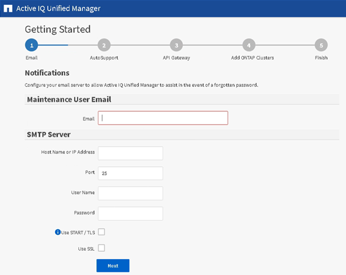

= Unified Manager Web UI の初期セットアップを実行する
:icons: font
:imagesdir: ../media/

[role="lead"]
Unified Manager を使用するには、 NTP サーバ、メンテナンスユーザの E メールアドレス、 SMTP サーバのホストなどを最初に設定し、 ONTAP クラスタを追加する必要があります。

* 必要なもの *

次の作業を完了しておきます。

* インストールの完了時に表示された URL を使用して Unified Manager Web UI を起動します
* インストール時に作成したメンテナンスユーザ（ Linux 環境の場合は umadmin ユーザ）の名前とパスワードを使用してログインします

Active IQ Unified Manager の Getting Started ページは、最初に Web UI にアクセスしたときにのみ表示されます。次のページは、 VMware 環境の場合のものです。

これらのオプションをあとから変更する場合は、 Unified Manager の左側のナビゲーションペインで一般オプションから選択できます。NTP 設定は VMware 専用です。この設定はあとから Unified Manager メンテナンスコンソールを使用して変更できます。

.手順
. Active IQ Unified Manager の初期セットアップページで、メンテナンスユーザの E メールアドレス、 SMTP サーバのホスト名とその他の SMTP オプション、および NTP サーバ（ VMware の場合のみ）を入力します。[* Continue （続行） ] をクリックします。
. AutoSupport ページで「 * Agree and Continue 」をクリックして、 Unified Manager から NetAppActive IQ への AutoSupport メッセージの送信を有効にします。
+
AutoSupport コンテンツの送信用にインターネットアクセスを提供するためにプロキシを指定する必要がある場合や、 AutoSupport を無効にする場合は、 Web UI から「 * General * > * AutoSupport * 」オプションを使用します。

. Red Hat および CentOS のシステムの場合、 umadmin ユーザのパスワードをデフォルトの「 admin 」から独自のパスワードに変更できます。
. API ゲートウェイのセットアップページで、 ONTAP REST API を使用して監視する ONTAP クラスタを Unified Manager で管理できるようにする API ゲートウェイ機能を使用するかどうかを選択します。[* Continue （続行） ] をクリックします。
+
この設定は、 Web UI の * General * > * Feature Settings * > * API Gateway * で後から有効または無効にできます。API の詳細については、を参照してください link:../api-automation/concept_get_started_with_um_apis.html["Active IQ Unified Manager API 開発者ガイド"]。

. Unified Manager で管理するクラスタを追加し、 * Next * をクリックします。管理するクラスタごとに、ホスト名またはクラスタ管理 IP アドレス（ IPv4 または IPv6 ）、ユーザ名およびパスワードクレデンシャルが必要です。ユーザには「 admin 」ロールが必要です。
+
この手順はオプションです。クラスタは、 Web UI の * Storage Management * > * Cluster Setup * からあとから追加できます。

. [ 概要 ] ページで、すべての設定が正しいことを確認し、 [ 完了 *] をクリックします。

Getting Started ページが閉じ、 Unified Manager の Dashboard ページが表示されます。
