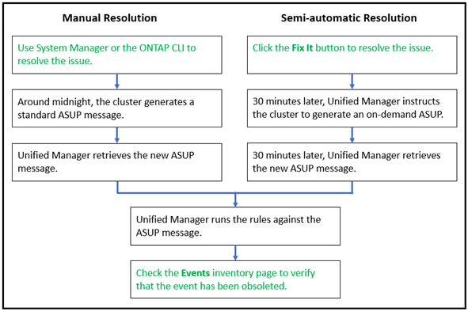

= Active IQプラットフォームイベントを解決する
:allow-uri-read: 
:icons: font
:imagesdir: ../media/

[role="lead"]
Active IQ プラットフォームのインシデントとリスクは、 Unified Manager の他のイベントと同様に、解決のために他のユーザに割り当て可能で、ステータスの種類も同じです。ただし、 [ 修正 ] ボタンを使用してこれらのタイプのイベントを解決すると、解決を数時間以内に検証できます。

次の図は、 Active IQ プラットフォームで生成されたイベントの解決時にユーザが実行する操作（緑）と Unified Manager で実行される操作（黒）を示しています。

手動で解決する場合は、 System Manager または ONTAP コマンドラインインターフェイスにログインして問題を修正する必要があります。問題を検証できるのは、午前 0 時にクラスタで新しい AutoSupport メッセージが生成されたあとです。

[Fix it* （修正） ] ボタンを使用して半自動の解決を実行する場合、修正が数時間以内に正常に完了したことを確認できます。
