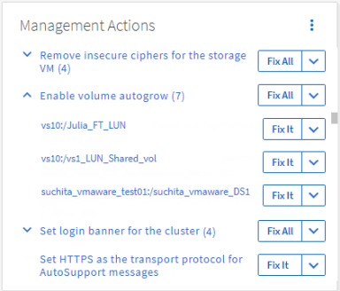

= Unified Manager の自動修復を使用して問題を修正します
:icons: font
:imagesdir: ../media/

[role="lead"]
イベントによっては、 Unified Manager の詳細な診断によって、 * Fix it * ボタンを使用して単一の解決策が提供されることがあります。解決策がある場合は、ダッシュボード、イベントの詳細ページ、左側のナビゲーションメニューのワークロード分析の順に表示されます。

ほとんどのイベントではイベントの詳細ページにさまざまな解決策が表示されるため、 ONTAP システムマネージャまたは ONTAP CLI を使用して最適な解決策を実装できます。問題を修正する解像度が 1 つで、 ONTAP の CLI コマンドで解決できることが Unified Manager で確認された場合は、 * Fix it * アクションを使用できます。

.手順
. * ダッシュボード * から解決できるイベントを表示するには、 * ダッシュボード * をクリックします。
+

. Unified Manager で修正可能な問題を解決するには、 * 修正 * ボタンをクリックします。複数のオブジェクトに存在する問題を修正するには、 * すべて修正 * ボタンをクリックします。

自動修正で解決できる問題については、を参照してください link:..//storage-mgmt/reference_what_ontap_issues_can_unified_manager_fix.html["Unified Manager で解決可能な問題"]
