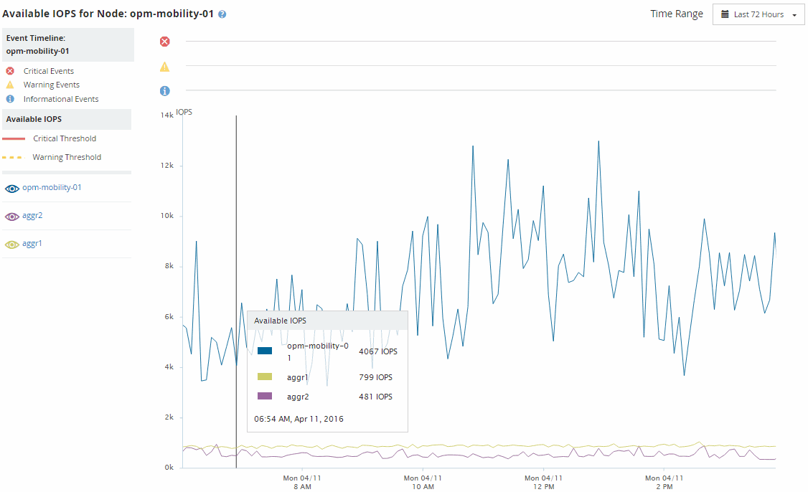

= ノードとアグリゲートの使用可能な IOPS の値の表示
:allow-uri-read: 
:icons: font
:imagesdir: ../media/

[role="lead"]
クラスタ内のすべてのノードまたはアグリゲートの使用可能な IOPS の値、または、 1 つのノードまたはアグリゲートの詳細を表示できます。

使用可能な IOPS の値は、パフォーマンスインベントリページおよびパフォーマンスエクスプローラページのノードとアグリゲートのグラフに表示されます。たとえば、ノード / パフォーマンスエクスプローラページでノードを表示しているときに、リストから「使用可能な IOPS 」カウンタチャートを選択すると、そのノードおよびそのノード上の複数のアグリゲートの使用可能な IOPS 値を比較できます。

ページにノードが表示され、リストから[Available IOPS]を選択する方法を示すUIのスクリーンショット。]

使用可能な IOPS カウンタを監視することで、次の項目を特定できます。

* 使用可能な IOPS の値が最も大きいノードまたはアグリゲート。今後ワークロードを導入可能な場所を判断します。
* 使用可能な IOPS の値が最も小さいノードまたはアグリゲート。今後発生する可能性のあるパフォーマンスの問題について監視が必要なリソースを特定します。
* 使用可能な IOPS の値が小さいアグリゲート上の最も負荷の高いボリュームと LUN 。

