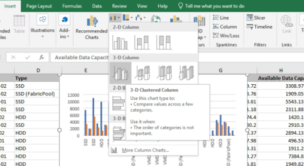
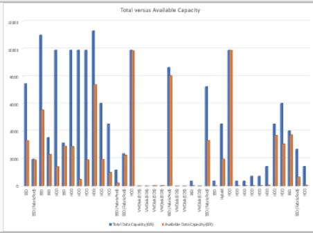

= 総計と利用可能な容量のグラフを表示するレポートを作成します
:allow-uri-read: 
:icons: font
:imagesdir: ../media/

[role="lead"]
ストレージの合計容量とコミット済み容量を Excel グラフ形式で分析するレポートを作成できます。

.開始する前に
* アプリケーション管理者またはストレージ管理者のロールが必要です。

健全性を開くには、次の手順を実行します。すべてのアグリゲートビュー、 Excel でのビューのダウンロード、合計容量とコミット済み容量のグラフの作成、カスタマイズした Excel ファイルのアップロード、最終レポートのスケジュール設定。

.手順
. 左側のナビゲーションペインで、 * Storage * > * Aggregates * をクリックします。
. [* レポート *>] > [* Excel のダウンロード *] を選択します。
+
image::../media/download_excel_menu.png[レポートからExcelをダウンロードする方法を示すUIスクリーンショット。]

+
ブラウザによっては、ファイルを保存するために * OK * をクリックする必要があります。

. Excel で、ダウンロードしたファイルを開きます。
. 必要に応じて、 * 編集を有効にする * をクリックします。
. データシートで、 [ タイプ（ Type ） ] 列を右クリックし、 [ * 並べ替え * （ Sort * ） ]>[ * 昇順（ * Sort a to Z ） ] を選択します。
+
image::../media/sort_01.png[タイプ列でソートを選択する方法を示すUIスクリーンショット。]

+
これにより、次のようなストレージタイプ別にデータが配置されます。

+
** HDD
** ハイブリッド
** SSD の場合
** SSD （ FabricPool ）

. [Type] 列、 [Total Data Capacity] 列、および [Available Data Capacity] 列を選択します。
. [*Insert*] メニューで、 [3-D 縦棒 ] グラフを選択します。
+
グラフがデータシートに表示されます。

+

. グラフを右クリックして、 * チャートの移動 * を選択します。
. [ 新規シート * ] を選択し、シートに「 Total Storage Charts * 」という名前を付けます。
+
[NOTE]
====
インフォメーションシートとデータシートの後に新しいシートが表示されることを確認します。

====
. グラフのタイトルに「 * Total versus available Capacity * 」と入力します。
. グラフを選択したときに使用できる * デザイン * および * フォーマット * メニューを使用して、グラフの外観をカスタマイズできます。
. 必要に応じて、ファイルに変更を保存します。ファイルの名前や場所は変更しないでください。
+

. Unified Manager で、 * Reports * > * Upload Excel * を選択します。
+
[NOTE]
====
Excel ファイルをダウンロードしたときと同じビューに表示されていることを確認します。

====
. 変更した Excel ファイルを選択します。
. * 開く * をクリックします。
. [Submit （送信） ] をクリックします。
+
[*Reports*>*Upload Excel*] メニュー項目の横にチェックマークが表示されます。

+
image::../media/upload_excel.png[Excelをレポートにアップロードする方法を示すUIスクリーンショット。]

. [ スケジュール済みレポート ] をクリックします。
. [ * スケジュールの追加 * ] をクリックして、新しいレポートのスケジュール特性を定義できるように、 [ レポートスケジュール * ] ページに新しい行を追加します。
+
[NOTE]
====
レポートの *XLSX* 形式を選択します。

====
. レポートスケジュールの名前を入力し、他のレポートフィールドに情報を入力して、チェックマーク（image:../media/blue_check.gif[""]）をクリックします。
+
レポートはテストとしてすぐに送信されます。その後、指定した頻度でレポートが生成され、リスト内の受信者に E メールで送信されます。

レポートに表示された結果を基に、アグリゲートの負荷を分散できます。
