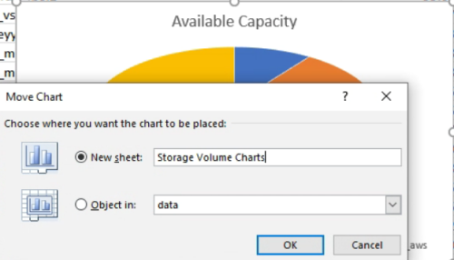

= 使用可能なボリューム容量グラフを表示するレポートの作成
:allow-uri-read: 
:icons: font
:imagesdir: ../media/

[role="lead"]
Excel グラフで使用可能なボリューム容量を分析するためのレポートを作成できます。

.開始する前に
* アプリケーション管理者またはストレージ管理者のロールが必要です。

次の手順に従って、健全性を開きます。すべてのボリュームビュー、 Excel でのビューのダウンロード、使用可能な容量グラフの作成、カスタマイズした Excel ファイルのアップロード、最終レポートのスケジュール設定を行います。

.手順
. 左側のナビゲーションペインで、 * Storage * > * Volumes * をクリックします。
. [* レポート *>] > [* Excel のダウンロード *] を選択します。
+
image::../media/download_excel_menu.png[レポートからExcelをダウンロードする方法を示すUIスクリーンショット。]

+
ブラウザによっては、ファイルを保存するために * OK * をクリックする必要があります。

. 必要に応じて、 * 編集を有効にする * をクリックします。
. Excel で、ダウンロードしたファイルを開きます。
. 「データ」シートで、「ボリューム」列と「使用可能なデータ」列で使用するデータを選択します。
. [ * 挿入 ] メニューで '[3-D 円グラフ .] を選択します
+
使用可能なスペースが最も多いボリュームがチャートに表示されます。グラフがデータシートに表示されます。

+
[NOTE]
====
ネットワーク構成によっては、列全体またはデータ行が多すぎると、円グラフが読めなくなることがあります。このサンプルでは 3-D 円グラフを使用していますが、任意のグラフタイプを使用できます。最適なグラフには、キャプチャするデータが表示されます。

====
. グラフのタイトルに「 * Available Capacity 」という名前を付けます。
. グラフを右クリックして、 * チャートの移動 * を選択します。
. [ 新規シート * ] を選択し、シートに「 * ストレージ容量チャート * 」という名前を付けます。
+
[NOTE]
====
インフォメーションシートとデータシートの後に新しいシートが表示されることを確認します。

====
+

. グラフを選択したときに使用できる * デザイン * および * フォーマット * メニューを使用して、グラフの外観をカスタマイズできます。
. 必要に応じて、ファイルに変更を保存します。
. Unified Manager で、 * Reports * > * Upload Excel * を選択します。
+
[NOTE]
====
Excel ファイルをダウンロードしたときと同じビューに表示されていることを確認します。

====
. 変更した Excel ファイルを選択します。
. * 開く * をクリックします。
. [Submit （送信） ] をクリックします。
+
[*Reports*>*Upload Excel*] メニュー項目の横にチェックマークが表示されます。

+
image::../media/upload_excel.png[Excelをレポートにアップロードする方法を示すUIスクリーンショット。]

. [ スケジュール済みレポート ] をクリックします。
. [ * スケジュールの追加 * ] をクリックして、新しいレポートのスケジュール特性を定義できるように、 [ レポートスケジュール * ] ページに新しい行を追加します。
. レポートスケジュールの名前を入力し、他のレポートフィールドに情報を入力して、チェックマーク（image:../media/blue_check.gif[""]）をクリックします。
+
[NOTE]
====
レポートの *XLSX* 形式を選択します。

====
+
レポートはテストとしてすぐに送信されます。その後、指定した頻度でレポートが生成され、リスト内の受信者に E メールで送信されます。

レポートに表示された結果を基に、ボリュームに負荷を分散できます。
