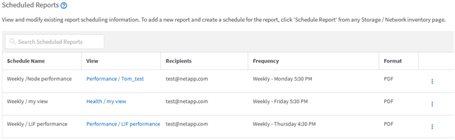

= スケジュール済みレポートの編集
:icons: font
:imagesdir: ../media/

[role="lead"]
スケジュールされたレポートは、 [ レポートスケジュール ] ページで編集できます。

* 必要なもの *

* アプリケーション管理者またはストレージ管理者のロールが必要です。

.手順
. 左側のナビゲーションペインで、 * ストレージ管理 * > * レポートスケジュール * をクリックします。
+

+
[NOTE]
====
適切な権限があれば、システム内のすべてのレポートとそのスケジュールを変更できます。

====
. [ 詳細 ] アイコンをクリックします image:../media/more_icon.gif[""] をクリックします。
. [ 編集（ Edit ） ] をクリックします。
. レポートスケジュールの * スケジュール名 * 、 * 受信者 * リスト、 * 頻度 * 、 * 形式 * を変更できます。
. 完了したら、チェックマークをクリックして変更を保存します。

