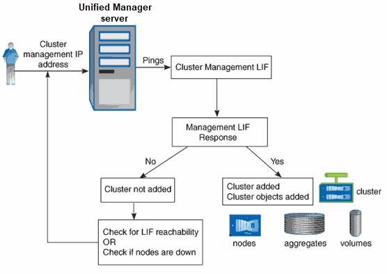

= 検出プロセスの仕組み
:icons: font
:imagesdir: ../media/

[role="lead"]
クラスタを Unified Manager に追加すると、サーバによってクラスタオブジェクトが検出され、サーバのデータベースに追加されます。検出プロセスの仕組みを理解しておくと、組織のクラスタとそのオブジェクトを管理する際に役立ちます。

デフォルトの監視間隔は 15 分です。 Unified Manager サーバにクラスタを追加した場合、そのクラスタの詳細が Unified Manager の UI に表示されるまでに 15 分かかります。

次の図は、 Active IQ Unified Manager での検出プロセスを示しています。

